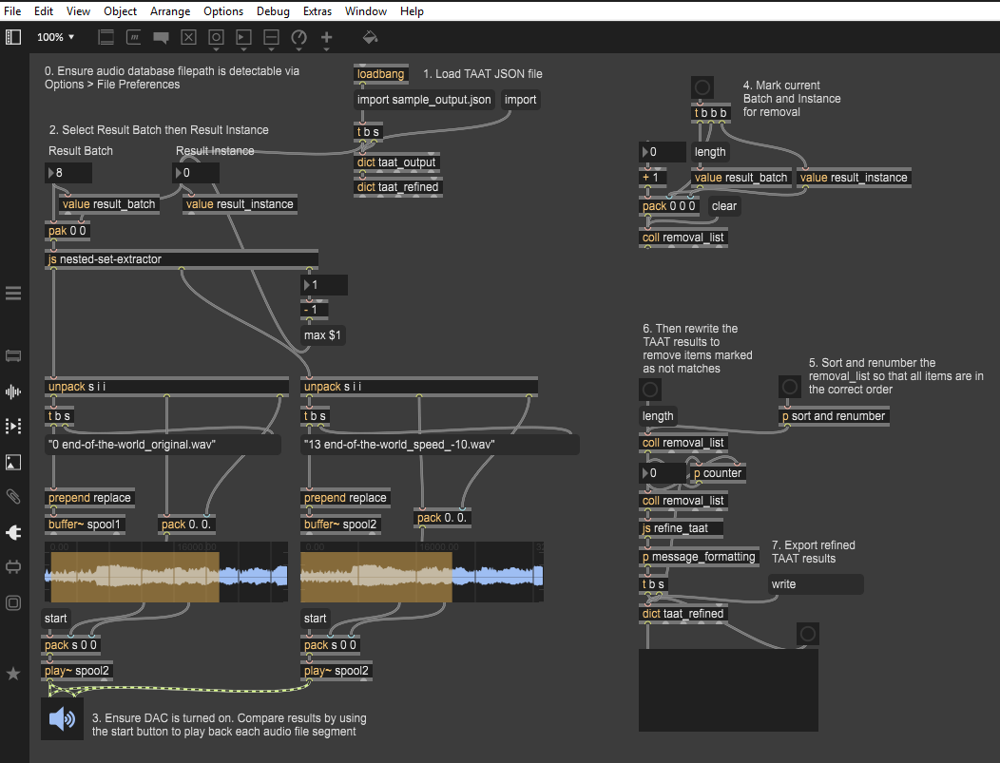

## Tape Archive Analysis Toolkit

**N.B**: At the present date (17/12/2025) this codebase is still under development, so the version published here should not be considered anything other than experimental.

### Installation

We highly recommend installing into a virtual environment.

#### Creating a virtual environment

To create a virtual environment we can use Python's inbuilt `venv` tool. Simply `cd` into the TAAT repository and execute the following command:

`python -m venv .venv`

This will create the hidden folder `.venv` at the top level of the repository.

You can call the virtual environment anything, but if you have cloned the repository we recommend only using the names `venv`, `.venv`, `env` or `.env`, as these will be ignored by Git.

To use your virtual environment you will need to activate it, using:

`source .venv/bin/activate`

Note the relative path to the `activate` command. When you are done with the virtual environment you should deactivate it using:

`deactivate`

#### Install using `pip`

To install taat using pip, from the top-level TAAT directory execute the following:

`python -m pip install .`

#### Install using `conda`

TBC

## Documentation

For comprehensive documentation please see https://relativeflux.github.io/taat/.

## Basic Usage

The code below provides an example of basic TAAT usage. For more advanced examples see the Tutorials page.

```python
from taat import query


FEATURES = ["melspectrogram", "tempogram", "rms", "spectral_centroid"]

# Run a query. Returns a QueryResult object.
query_result = query(source_dir="path/to/audio/files/to/query/against",
                     query_filepath="path/to/file/to/query.wav",
                     features=FEATURES,
                     sr=16000,
                     k=7,
                     n_fft=2048,
                     hop_length=1024)

# Pretty-print the result.
query_result.pprint()
{'results_0': {'score': 0.3517379236755508,
               'query_file': '001_End_of_the_World_(op.1)_chunk_7.wav',
               'query_segments': [[7151.746031746032, 17740.045351473924],
                                  [7198.185941043084, 17786.485260770973],
                                  [7151.746031746032, 17693.60544217687],
                                  [7244.625850340136, 17832.925170068025],
                                  [6315.827664399093, 16904.126984126986]],
               'reference_file': '001_End_of_the_World_(op.1)_chunk_1.wav',
               'reference_segments': [[11192.01814058957, 21780.31746031746],
                                      [11192.01814058957, 21780.31746031746],
                                      [11238.45804988662, 21780.31746031746],
                                      [11192.01814058957, 21780.31746031746],
                                      [11192.01814058957, 21780.31746031746]]},
 'results_1': {'score': 0.45740568618560096,
               'query_file': '001_End_of_the_World_(op.1)_chunk_7.wav',
               'query_segments': [[9380.861678004536, 21780.31746031746],
                                  [8498.503401360544, 21780.31746031746],
                                  [9427.301587301587, 21780.31746031746],
                                  [7616.145124716553, 19551.201814058957],
                                  [7662.585034013605, 19551.201814058957]],
               'reference_file': '001_End_of_the_World_(op.1)_chunk_2.wav',
               'reference_segments': [[6037.188208616781, 18436.643990929708],
                                      [6037.188208616781, 19319.0022675737],
                                      [6037.188208616781, 18390.20408163265],
                                      [6037.188208616781, 17972.244897959183],
                                      [6037.188208616781, 17925.804988662134]]}}

# Export the result as JSON
query_result.export("path/to/result/file.json")

# Display a plot of the scores
query_result.plot()

# Write matches to disk as audio files
query_result.write("path/to/output/folder")
```

### The taat_interpreter Max patch

We also have a Max patch available, the taat_interpreter (created by Dr Sam Gillies), which allows to load exported JSON output from a query result and display the it as playable audio waveforms:

