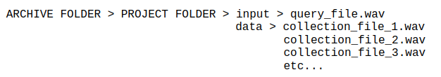
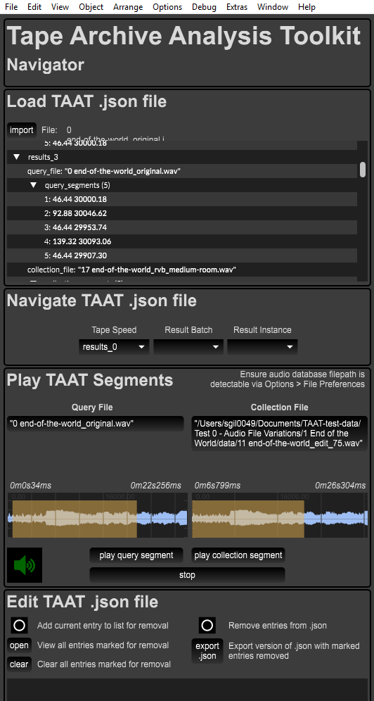

### Installation

We highly recommend installing into a virtual environment.

#### Creating a virtual environment

To create a virtual environment we can use Python's inbuilt `venv` tool. Simply `cd` into the TAAT repository and execute the following command:

`python -m venv .venv`

This will create the hidden folder `.venv` at the top level of the repository.

You can call the virtual environment anything, but if you have cloned the repository we recommend only using the names `venv`, `.venv`, `env` or `.env`, as these will be ignored by Git.

To use your virtual environment you will need to activate it, using:

`source .venv/bin/activate`

Note the relative path to the `activate` command. When you are done with the virtual environment you should deactivate it using:

`deactivate`

#### Install using `pip`

To install taat using `pip`, from the top-level TAAT directory execute the following:

`python -m pip install .`

#### Install using `conda`

TBC

### API Usage

TAAT provides a [Python API](reference.md), which may be integrated into custom Python scripts and applications built by the user, but it also offers an easy to use command line version, available under `taat/scripts/taat.py`. This section outlines usage of the Python API, for information on using the command line script see the [Command Line Usage](#command-line-usage) section below.

The code below provides an example of basic TAAT Python API usage. For more advanced examples see the [Tutorials](tutorials.md) page.

```python
from taat import query


FEATURES = ["melspectrogram", "tempogram", "rms", "spectral_centroid"]

# Run a query.
query_result = query(source_dir="path/to/audio/files/to/query/against",
                     query_filepath="path/to/file/to/query.wav",
                     features=FEATURES,
                     sr=16000,
                     k=7,
                     n_fft=2048,
                     hop_length=1024)

# Write matches to disk as audio files
query_result.write("path/to/output/folder")
```

### Command Line Usage

The following section outlines TAAT usage as a command line tool, via the script available at `taat/scripts/taat.py`. Whilst these instructions are provided for the non-technical user, the user is assumed to have at least a basic familiarity with command prompt (Windows) or terminal (Mac/Linux) applications.

**N.B**: Please note that in order to run the command line script version of TAAT it is still necessary to have Python avalable on your system, and to have installed TAAT according to the [instructions](#installation) provided in the previous section.

#### Running the script

To run the script navigate to the top-level TAAT directory and at the command prompt/terminal enter the following: 

	`python scripts/taat.py --project_dir=<drag and drop your project directory here>`

Replace the text contained within the `<>` marks with the directory containing the data you want to analyse (see the section [Data file structure](#data-file-structure) below) and press enter. 

You should then see visual output describing the activity of the TAAT analysis. 

When the process has finished, analysis results will be output as a .json file to the results folder in the TAAT directory.

#### Command line parameters

The following table gives information on the script's command line parameters:

| Parameter Name  | Parameter Description |
| ------------- | ------------- |
| `project_dir`  | Path to the folder containing the audio files for analysis.  |
| `config_file`  | Path to the YAML config file (defaults to `scripts/default.config.yaml`).  |
| `results_dir`  | Directory in which to save exported JSON results files.  |

#### Data file structure

TAAT assumes a file structure that enables multiple collections of material to be processed with one call of the taat.py script. The necessary structure is as follows: 


								
All folders and file names can be variable except for the data and input folders. Note that the input folder contains just a _single_ audio file to be compared against (A). The data folder contains a collection of audio files that will be compared against the input file (B1, B2, B3, etc...) As part of the analysis the TAAT will create a series of similarity matrices such as: AxB1, AxB2, AxB3, etc...

#### Config file parameters

The script's config file is a simple text file that may be modified in any text editor. The parameters are mostly identical to those of the `query` function in the [TAAT Python API](reference.md), apart from the `tape_speed` parameter, which allows to test for variations in tape speed between the query and collection audio files. It works by creating a copy of the query file at each tape speed. For efficiency, a range of tape speed presets have been prepared to test a range of possible changes in pitch quality. Intervals are checked within an octave above and below the original file. The following table gives information on each of these presets:

| Preset Name  | Preset Description |
| ------------- | ------------- |
| `none`  | Does not check for pitch shift.  |
| `simple`  | Checks for octave transposition.  |
| `simple_variable`  | Checks for pitch transpositions of an octave and a fifth.  |
| `complex_variable`  | Checks for pitch transpositions across a diatonic scale .  |
| `chromatic_variable`  | Checks for pitch transpositions across a chromatic scale.  |

### The TAAT Navigator Max patch

We also have a Max patch available, the TAAT Navigator (created by Dr Sam Gillies), which allows to load exported JSON output from a query result and display it as playable audio waveforms:


